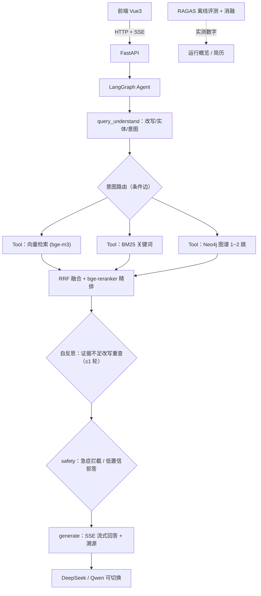

# 本草智问 MediRAG —— Agentic 中医药知识问答系统（Python 版）

> 基于 **LangGraph 状态机** 的 Agentic RAG 知识库问答系统。把三路检索（语义向量 / BM25 关键词 / Neo4j 知识图谱）封装为标准 Tool，由查询理解节点输出意图后经条件边自主路由，证据不足时触发**受控自反思重查**，并带**双层医疗安全兜底**与**RAGAS 评测闭环**。
>
> ⚠️ 仅用于学习演示，不替代医师诊断。

## 技术栈

Python 3.12 · FastAPI · LangGraph · LangChain · Neo4j 5.20 · MySQL 8.4 · NumPy 向量后端 · RAGAS · Vue 3 (Vite + TypeScript + Element Plus + ECharts)

## 架构



- **Agentic 而不自由 ReAct**：固定状态机 + 有限 Tool 路由 + 受控反思，医疗场景可控、可解释、可复现。
- **三层证据合流**：文献（向量/关键词）+ 图谱事实，RRF 融合后精排；组成/禁忌类结论只引用图谱事实，不加减药材。
- **双层安全兜底**：急症词命中强制就医提示；置信度不足先补查、仍不足则拒答"知识库未检索到可靠依据"，宁可说不知道也不编造。
- **来源可追溯**：回答附带文献 文档名/章节/页码 与图谱路径，前端 SSE 实时展示检索过程与反思轨迹。

## 目录

```
backend/            FastAPI 后端（含 app.agent / retrieval / graph / evaluation）
web/                Vue3 前端（1:1 还原截图）
deploy/             docker-compose（Neo4j + MySQL；Redis P1 可选）
data/corpus/        文献语料（小而真）
data/graph/         图谱 seed
data/eval/          Golden QA 评测集 + 评测输出 + bad case 归档
docs/               方案与前端还原规格（真源）
```

## 启动

### 1) 中间件（Neo4j + MySQL）

```bash
docker compose -f deploy/docker-compose.yml up -d
# Neo4j Browser: http://localhost:7474 （neo4j / medirag123）
```

### 2) 后端

```bash
cd backend
python -m venv .venv && .venv/Scripts/activate      # Windows
pip install -r requirements.txt
cp .env.example .env               # 填入 DEEPSEEK_API_KEY / SILICONFLOW_API_KEY
python -m app.ingestion.pipeline   # 语料向量化，写入 data/vectorstore/index.json
uvicorn app.main:app --port 8000   # 建议 --reload
```

### 3) 前端

```bash
cd web
npm install
npm run dev                        # http://localhost:5173，/api 代理到 8000
```

## 离线评测（阶段 6）

Golden QA 评测集位于 `data/eval/golden_qa.jsonl`（文献/图谱/综述/拒答四分类，50+ 条，全部来自内置语料与图谱）。

```bash
cd backend
python -m app.evaluation.run_eval --limit 5     # 小样本冒烟（消融 + 兜底 + bad case）
python -m app.evaluation.run_eval --ragas       # 全量 + RAGAS 三指标（faithfulness / answer relevancy / context precision）
```

输出写入 `data/eval/output/eval_*.json`；召回失败的样本归档到 `data/eval/bad_cases/`。每次一键查看最近实测数字：

```bash
python -m app.evaluation.metrics
```

> **数字纪律**：README 不固化评测数字，避免与最新结果脱节。简历/汇报中的任意量化指标一律以 `metrics.py` 输出的最近一次实测为准，严禁虚构。

## 部署

- 后端：`uvicorn app.main:app --host 0.0.0.0 --port 8000`
- 前端：`cd web && npm run build`，产物 `dist/` 由任意静态服务器托管，`/api` 反代到后端。

## 免责声明

本系统仅用于中医药知识科普与工程学习演示。中医药讲究辨证论治，任何用药与治疗请咨询执业中医师；出现急症请立即就医或拨打 120。