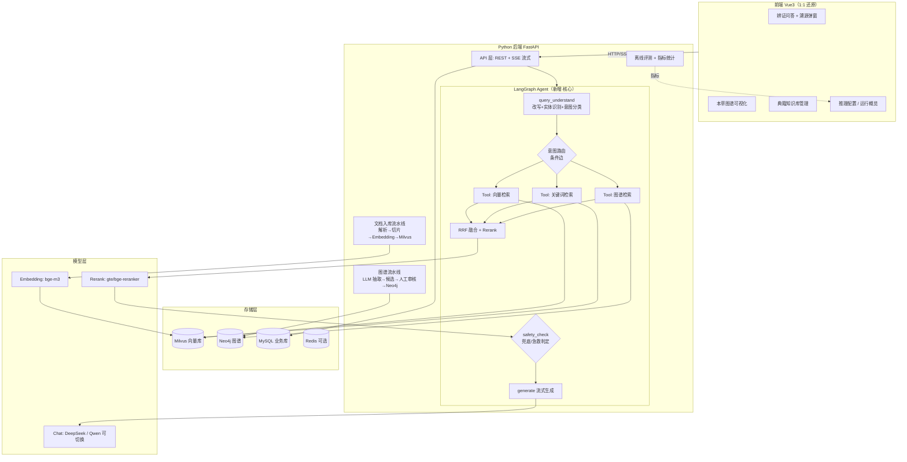

# 本草智问 MediRAG：Java 项目 → Python Agent 方向改造方案

> 目标：把网上找到的「Spring Boot 3 + LangChain4j + Vue3」中医药 RAG 项目，改造成一个
>
> **能写进简历、精准对口 Python Agent 开发实习**
>
> 的项目。
> 约束：
>
> **前端界面 1:1 还原原项目效果**
>
> ；后端好的设计保留、不适配的替换；改造方向严格对齐项目内《Agent 岗位分析报告（13 岗位）》。
> 文档依据：原项目问答流程图、8 张前端截图、岗位分析报告中的频次数据（均为项目内真实材料，未编造）。


***

## 一、一句话定位


|      | 原项目                               | 改造后                                                                   |
| ---- | --------------------------------- | --------------------------------------------------------------------- |
| 名称   | 本草智问（中医药知识系统）                     | **本草智问 Agentic RAG（Python 版）**                                        |
| 本质   | 固定 RAG 流水线的**企业知识问答系统**           | Agent 自主编排检索工具的**可溯源中医药知识智能体**                                        |
| 后端   | Spring Boot 3 + LangChain4j（Java） | **FastAPI + LangChain + LangGraph（Python）**                           |
| 前端   | Vue 3                             | Vue 3（1:1 还原，不变）                                                      |
| 存储   | Milvus + Neo4j + Redis + MySQL    | Milvus + Neo4j + MySQL（Redis 降级为可选）                                   |
| 检索   | 三路固定串行 / 并行调用                     | **三路检索封装为 Tool，由 LangGraph Agent 按意图自主路由**                            |
| 简历卖点 | GraphRAG、来源可追溯                    | **Agentic GraphRAG：Function Calling 工具编排 + 图谱 / 文献双证据 + 安全兜底 + 评测闭环** |

**核心改造思想一句话**：原项目是 "写死的检索流水线"，改造后是 "Agent 自己决定用哪些检索工具、按什么顺序用"—— 这一步正好补上岗位报告里频次最高（13/13）的「Agent 智能体搭建」，而原项目恰恰没有。


***

## 二、为什么这样改：逐能力对齐 13 个岗位

下表频次全部来自《Agent 岗位分析报告.html》的 Top50 统计。**原项目状态**依据其简介、流程图和截图判定。


| 岗位能力项                     | 频次 (/13) | 原项目                    | 改造后                             | 落地位置                |
| ------------------------- | -------- | ---------------------- | ------------------------------- | ------------------- |
| Agent / 智能体搭建             | 13       | ✗ 固定流水线，无 Agent        | ✅ **LangGraph 状态机 + 条件路由**      | `agent/workflow.py` |
| 大语言模型 LLM                 | 13       | ✅ qwen-plus            | ✅                               | 多模型适配层              |
| Prompt Engineering        | 12       | ✅ 中医药专用 Prompt         | ✅ 补 Few-shot/CoT/ 结构化输出         | `prompts/`          |
| RAG 检索增强生成                | 11       | ✅ 三路检索                 | ✅ 保留并强化                         | `retrieval/`        |
| **Python**                | 10       | ✗ Java                 | ✅ **全量 Python**                 | 全局                  |
| 知识库问答                     | 8        | ✅ 典籍知识库                | ✅                               | 文档入库模块              |
| LLM API 调用与模型集成           | 8        | ✅ 单模型                  | ✅ **DeepSeek/Qwen 可切换的模型路由**    | `llm/router.py`     |
| **Function/Tool Calling** | 7        | ✗                      | ✅ **三路检索全部 Tool 化**             | `agent/tools.py`    |
| **LangChain/LangGraph**   | 7        | ✗ LangChain4j（Java 生态） | ✅ Python 原生框架                   | 全局                  |
| Workflow 工作流编排            | 6        | △ 硬编码链路                | ✅ StateGraph 节点 + 条件边           | `agent/workflow.py` |
| 向量数据库                     | 6        | ✅ Milvus               | ✅ Milvus（开发期可先用 FAISS）          | `vectorstore/`      |
| 模型评测 / 效果评估               | 6        | △ 仅页面统计                | ✅ **离线评测脚本 + 在线指标面板**           | `evaluation/`       |
| 多轮对话管理                    | 3        | △ 弱                    | ✅ LangGraph Checkpointer + 历史改写 | `agent/memory.py`   |
| FastAPI / Flask           | 3        | ✗ Spring Boot          | ✅ FastAPI + SSE                 | `api/`              |
| MySQL                     | 3        | ✅                      | ✅（SQLAlchemy ORM）               | `db/`               |
| Redis                     | 3        | ✅                      | ○ 可选（会话缓存 / 限流，时间紧可砍）           | —                   |
| React/Vue 前端              | 3        | ✅ Vue3                 | ✅ Vue3 原样还原                     | `web/`              |
| Embedding 模型              | 3        | ✅                      | ✅ bge-m3 /gte 系列                | 配置项                 |
| MCP                       | 2        | ✗                      | ○ **进阶加分**：把图谱查询暴露为 MCP Server  | `mcp_server/`       |
| Docker                    | 2        | 未在材料中体现                | ✅ docker-compose 一键起全部中间件       | `deploy/`           |
| 知识图谱                      | 1        | ✅ Neo4j（**稀缺差异化**）     | ✅ 保留，这是你区别于普通 RAG 简历的关键         | `graph/`            |
| Memory 记忆管理               | 1        | ✗                      | ✅ 会话记忆 + 检索反馈记忆                 | `agent/memory.py`   |
| 大模型微调 LoRA                | 4        | ✗                      | **不做**（见第十一节，性价比低）              | —                   |
| 多模态                       | 4        | ✗                      | **不做**（偏离中医药文本主线）               | —                   |
| 多 Agent 协作                | 4        | ✗                      | ○ 进阶：实体抽取独立成审核 Agent，非必须        | —                   |

结论：改造完成后，**频次 ≥5 的核心能力项全部覆盖**，且 "知识图谱 + 医疗安全兜底 + 评测闭环" 是大多数候选人项目里没有的差异化亮点。


***

## 三、原项目解构（改造前必须吃透的事实）

### 3.1 问答流水线（来自流程图，逐节点还原）


```
用户问题

&#x20; → 问题改写 / 实体识别 / 意图分类          （查询理解层）

&#x20; → 三路并行召回：

&#x20;      ├─ Milvus 向量召回（语义相似度）

&#x20;      ├─ 关键词召回（BM25，捕捉中医药专有名词）

&#x20;      └─ Neo4j 图谱查询（1\~2 跳）→ 实体/关系/路径

&#x20; → RRF 融合与重排序（向量 + 关键词两路）

&#x20; → 汇合图谱实体关系路径，形成「文献证据」

&#x20; → 中医药专用 Prompt 组装

&#x20; → SSE 流式回答 + 文献引用 + 图谱路径
```

截图「知识检索与图谱溯源」弹窗把这条链路做成了 5 个可见步骤：**问句理解 → 多路检索 → 证据融合 → 相关性排序 → 生成回答**，并展示每步的中间结果（原始问题 / 改写查询、三路命中数、融合数、进入上下文的证据条数、证据充分度状态）。**这个 "检索过程可视化" 是极佳的面试演示点，必须保留。**

### 3.2 八个前端页面（来自截图，逐一记录）


| # | 页面            | 关键元素（截图事实）                                                                                                                                                                                                                             |
| - | ------------- | -------------------------------------------------------------------------------------------------------------------------------------------------------------------------------------------------------------------------------------- |
| 1 | **登录页**       | 左侧深绿品牌区：标题 "基于知识图谱与 RAG 的中医药智能问答系统"，三特性（典籍文献统一入库 / 实体关系审核发布 / 问答结论全程溯源）；右侧登录卡（用户名 admin、密码、记住用户名、体验账号：管理员 admin / 知识用户 user1）                                                                                                          |
| 2 | **辨证问答（空态）**  | 左栏会话列表（新对话、全部 / 已收藏、历史会话）；中部 "开始一次可追溯的辨证问答"、三个特性标签、2×3 常用问题卡片（如 "四君子汤由哪些中药组成？"）                                                                                                                                                        |
| 3 | **辨证问答（回答态）** | 流式回答正文 → 绿色安全提示框（"严格依据图谱事实… 不可自行套方"）→ 图谱依据（【图谱事实 N】实体 -- 关系 --> 实体）→ 文献来源 → 可折叠 "证据来源 (N)" 列表，每条标注 `[图谱]/[文献]`、关系、来源；底部输入框 + 固定免责声明 "… 如有紧急情况请拨打 120"                                                                                  |
| 4 | **检索溯源弹窗**    | 5 步进度条；步骤 1 原始问题→改写后查询；步骤 2-3 四个数字卡（向量检索 / 中医药图谱 N 个命中实体 / 关键词检索 / 证据融合 RRF）；步骤 4 进入上下文证据数 + "证据充分，正常生成" 状态                                                                                                                            |
| 5 | **本草图谱**      | 图谱浏览 / 候选审核双 Tab；搜索框 + 实体类型筛选 + 查询 + 重新导入；左栏实体结果列表（带类型点：中药 / 方剂 / 症状 / 功效 / 禁忌）；中部力导向关系图（节点按类型着色，边标注 组成 / 主治 / 功效 / 禁忌）；右栏实体详情（别名 / 说明 / 来源）                                                                                           |
| 6 | **典籍知识库**     | 顶部统计卡（典籍文献数、知识切片数）；分类筛选；文档表格（名称 / 大小 / 格式 / 状态 / 上传时间 / 操作：详情・下载・重命名）；上传弹窗：拖拽区、支持格式（PDF/DOC/DOCX/RTF/PPT/PPTX、XLS/XLSX/CSV/TSV、TXT/MD/HTML/JSON/XML/YAML/LOG，单文件 ≤100MB）、**知识主题必选**（内科 / 外科 / 儿科 / 妇科 / 情志脑病 / 筋骨伤科 / 皮肤病证 / 五官病证 8 类） |
| 7 | **运行概览**      | 问答量趋势折线（近 14 天）、用户角色分布环形图、知识主题分布环形图、知识库状态柱状（上传中 / 处理中 / 就绪 / 失败）、检索质量（满意度进度条、检索兜底率、有用 / 无用反馈、兜底次数、正常检索）                                                                                                                                |
| 8 | **推理配置**      | 混合检索组：语义召回数 20、关键词召回数 20、融合候选数 25、最终证据数 5、融合平衡系数 60（均带默认值与重置）；生成模型组：对话模型 qwen-plus 下拉、回答灵活度 0.30、问句理解灵活度 0.10；保存本组 / 恢复全部默认                                                                                                            |
| — | 账户管理 / 我的档案   | 侧栏存在但无截图，按标准后台页做即可，优先级最低                                                                                                                                                                                                               |

### 3.3 视觉设计 Token（从截图提取，前端还原直接用）


* **侧边栏**：深墨绿底（约 `#16332a`～`#1e4638`），白色 14px 菜单文字，选中项为更亮的绿色块，左侧栏宽约 200px，可折叠。

* **主色**：中医药绿（约 `#2f7d5b` / `#3a8f63`），用于主按钮、选中态、链接、图表主色。

* **背景**：主区域浅灰白 `#f6f8f7`，卡片纯白、圆角 10–12px、细边框、极轻阴影。

* **语义色**：安全提示 = 浅绿底深绿字；禁忌节点 = 红褐 `#b4554a`；症状节点 = 橙；功效 / 中药 / 方剂 = 不同深浅绿。

* **字体**：系统默认无衬线（PingFang / 微软雅黑），标题 18–22px 600 字重，正文 14px。

* **整体观感**：典型 Element Plus / Ant Design 企业后台风 → 前端组件库选 **Element Plus**，用上述绿色定制主题变量即可高度还原。


***

## 四、目标架构设计（改造核心）

### 4.1 总体架构




### 4.2 核心升级：从「固定流水线」到「Agentic RAG」

这是全方案最重要的设计，也是面试时你和普通 RAG 项目拉开差距的地方。

**原项目**：三路检索每次都全量执行，写死在代码里。

**改造后**：三路检索是三个标准 Tool，LangGraph 根据「问题理解」节点输出的意图，用条件边决定调哪个、是否并行。

**意图 → 工具路由矩阵**（面试可直接讲）：


| 用户问题类型                         | 识别特征        | 路由决策                     | 理由                               |
| ------------------------------ | ----------- | ------------------------ | -------------------------------- |
| 组成 / 禁忌 / 关系查询，如 "四君子汤由哪些中药组成" | 实体明确、问关系    | **图谱工具为主**（1–2 跳），向量工具兜底 | 图谱事实精确、无歧义，截图中该问题命中 22 条图谱、0 条向量 |
| 概念辨析 / 机理，如 "风寒束表与风热犯表有什么区别"   | 无单一实体、需对比阐述 | **向量 + 关键词并行**，图谱补实体背景   | 需要文献段落级证据                        |
| 开放综合问题，如 "脾气虚常见哪些症状和方剂"        | 实体 + 阐述混合   | **三路全开 → RRF**           | 保证召回率                            |
| 知识库未覆盖 / 闲聊                    | 实体识别为空且向量低分 | **不调工具，直接兜底回复**          | 对应医疗安全兜底，避免编造                    |

**LangGraph 状态（State）设计**：


```
class AgentState(TypedDict):

&#x20;   question: str                 # 用户原始问题

&#x20;   chat\_history: list            # 多轮历史（Memory）

&#x20;   rewritten\_query: str          # 改写后查询

&#x20;   entities: list\[dict]          # 识别出的中医药实体（名/类型）

&#x20;   intent: str                   # 意图：relation / concept / complex / chitchat

&#x20;   plan: list\[str]               # Agent 决定调用的工具列表（Function Calling 轨迹）

&#x20;   vector\_hits: list             # 向量召回

&#x20;   keyword\_hits: list            # 关键词召回

&#x20;   graph\_hits: list              # 图谱路径

&#x20;   fused\_evidence: list          # RRF 融合 + rerank 后的证据

&#x20;   confidence: float             # 置信度（top 分数 / 命中数综合）

&#x20;   safety\_flag: str | None       # emergency / low\_confidence / ok

&#x20;   answer\_stream: str            # 最终回答

&#x20;   trace: list\[dict]             # 全链路追踪，喂给前端「溯源弹窗」逐步点亮
```

**节点与边**：


```
START

&#x20;→ query\_understand（LLM 一次调用同时输出 改写query/实体/意图，结构化 JSON 输出）

&#x20;→ route（条件边：按 intent 选择工具子集，体现 Workflow 编排）

&#x20;→ retrieve（并行执行被选中的 Tool，每个 Tool 是标准 @tool，天然就是 Function Calling 证据）

&#x20;→ fuse\_and\_rerank（RRF 融合 + reranker；图谱证据单独标记不参与 RRF、直接进上下文）

&#x20;→ safety\_check（两路兜底：① 急救症状词表→强制就医提醒；② 置信度<阈值→"知识库未匹配"）

&#x20;→ generate（组装中医药专用 Prompt，SSE 流式输出）

&#x20;→ END
```

> 为什么用条件路由而不是让 LLM 无限 ReAct 循环？—— 医疗场景要求
>
> **可控、可解释、可复现**
>
> ，固定状态机 + 有限工具自主路由，比让模型自由 ReAct 更稳；这个 "为什么这么设计" 本身就是面试加分回答（体现工程判断）。

### 4.3 SSE 事件协议（前端溯源弹窗依赖它）

后端用 SSE（FastAPI 的 `StreamingResponse` / `sse-starlette`）按节点推进度，前端收到什么就点亮第几步：


```
event: step          data: {"step":"understand","title":"问句理解","raw":...,"rewritten":...}

event: step          data: {"step":"retrieve","vector\_n":20,"graph\_n":22,"keyword\_n":0,"entities":\[...]}

event: step          data: {"step":"fuse","candidate\_n":25,"method":"RRF"}

event: step          data: {"step":"rerank","evidence\_n":5,"confidence":0.82,"status":"证据充分，正常生成"}

event: token         data: {"text":"四君子汤"}          # 回答正文逐 token

event: references    data: {"docs":\[...],"graph\_facts":\[...]}   # 引用与图谱事实

event: safety        data: {"type":"ok"|"low\_confidence"|"emergency","message":...}

event: done          data: {"message\_id":...,"metrics":{...}}
```

### 4.4 医疗安全兜底机制（保留并做成亮点）

原项目已有两层兜底，全部保留，代码独立成 `safety/` 模块，方便面试单讲：


1. **检索置信度兜底**：最终证据数 = 0 或 rerank top 分数低于阈值 → 不走生成，明确回复 "知识库中未检索到可靠依据"，**宁可说不知道也不编**（对应 LLM 幻觉治理，岗位报告 LLM 原理项）。

2. **急救症状拦截**：问题或实体命中 "胸痛 / 昏迷 / 大出血 / 休克 / 孕妇出血…" 等急症词表 → 回答顶部强制插入 "请立即就医 / 拨打 120"，与截图底部免责声明呼应。

3. **图谱事实约束**：回答 Prompt 中强制 "组成 / 禁忌类结论只能引用给定图谱事实，不得加减药材"，对应截图绿色提示框文案。


***

## 五、技术选型总表（保留 / 替换 / 砍掉）


| 层            | 原项目           | Python 改造选型                                                                   | 决策   | 理由                                     |
| ------------ | ------------- | ----------------------------------------------------------------------------- | ---- | -------------------------------------- |
| Web 框架       | Spring Boot 3 | **FastAPI** + uvicorn + sse-starlette                                         | 替换   | 岗位 3 次提及；原生 async，SSE 简单；自带 OpenAPI 文档 |
| Agent/LLM 编排 | LangChain4j   | **LangChain + LangGraph**                                                     | 替换   | 岗位 7 次提及，Python Agent 生态绝对主流           |
| 向量库          | Milvus        | **Milvus**（开发期 milvus-lite 或 FAISS 起步）                                        | 保留   | 岗位 6 次提及；与原项目一致，简历可写同一栈                |
| 图谱库          | Neo4j         | **Neo4j** + 官方 neo4j Python driver                                            | 保留   | 差异化核心，1–2 跳 Cypher 直接迁移                |
| 关键词检索        | 未明示（大概率 ES）   | **rank-bm25** 起步，进阶 Elasticsearch                                             | 简化   | 实习项目无需为 BM25 单独部署 ES                   |
| Rerank       | gte-rerank    | **bge-reranker-v2-m3**（本地 sentence-transformers / Xinference 部署）              | 替换   | 开源免费、中文效果好、可本地跑                        |
| Embedding    | 未明示           | **bge-m3**（本地）或 API embedding                                                 | 替换   | 中文 + 长文本，免费可复现                         |
| 对话模型         | qwen-plus     | **DeepSeek + Qwen 双适配，配置可切换**                                                 | 升级   | 命中 "多模型集成"8 岗位；推理配置页下拉直接对接             |
| 关系型库         | MySQL         | MySQL + **SQLAlchemy 2**                                                      | 保留   | 存文档元数据 / 会话 / 反馈 / 用户                  |
| 缓存           | Redis         | Redis **可选**（限流 + 会话缓存），时间紧先用内存 dict                                          | 降级   | 对核心卖点无贡献，不为它阻塞进度                       |
| 文档解析         | 多格式自研         | **unstructured + pypdf + python-docx + openpyxl + python-pptx + markdownify** | 替换   | Python 生态解析多格式远比 Java 简单               |
| 前端           | Vue 3         | **Vue 3 + Vite + TS + Pinia + Element Plus + ECharts**                        | 保留还原 | 见第七节                                   |
| 关系图渲染        | 未明示           | **ECharts graph**（或 vis-network / AntV G6）                                    | 新增   | 还原本草图谱力导向图                             |
| 部署           | 未明示           | **Docker Compose**（milvus/neo4j/mysql/backend/web 一键起）                        | 新增   | 命中 Docker，且面试官能一键复现                    |
| 评测           | 页面统计          | **离线评测脚本（Golden QA 集 + RAGAS 思路指标）+ 在线反馈统计**                                  | 升级   | 命中 "模型评测"6 岗位，见 6.8                    |


***

## 六、后端工程设计

### 6.1 目录结构（建议直接照此建仓）


```
medirag-python/

├── backend/

│   ├── app/

│   │   ├── main.py                    # FastAPI 入口、CORS、路由挂载

│   │   ├── config.py                  # pydantic-settings 读 .env（模型/库连接/阈值）

│   │   ├── api/

│   │   │   ├── chat.py                # 问答 SSE 接口

│   │   │   ├── knowledge.py           # 知识库上传/列表/下载/重命名/删除

│   │   │   ├── graph\_api.py           # 图谱搜索/详情/候选审核

│   │   │   ├── config\_api.py          # 推理配置读写

│   │   │   ├── stats.py               # 运行概览统计

│   │   │   └── auth.py                # 登录/角色（简化版 JWT）

│   │   ├── agent/

│   │   │   ├── workflow.py            # LangGraph StateGraph（核心）

│   │   │   ├── state.py               # AgentState

│   │   │   ├── tools.py               # 三个检索 Tool（Function Calling）

│   │   │   ├── memory.py              # checkpointer / 多轮历史

│   │   │   └── prompts/               # 全部 Prompt 模板（见 6.7）

│   │   ├── retrieval/

│   │   │   ├── vector\_store.py        # Milvus 封装（召回、写入）

│   │   │   ├── keyword.py             # BM25 关键词召回

│   │   │   ├── rrf.py                 # RRF 融合算法

│   │   │   └── reranker.py            # bge-reranker 封装

│   │   ├── graph/

│   │   │   ├── neo4j\_client.py        # 驱动、1\~2 跳 Cypher

│   │   │   ├── extractor.py           # LLM 抽取实体关系（候选）

│   │   │   └── importer.py            # 基础数据导入

│   │   ├── ingestion/

│   │   │   ├── parsers.py             # 10+ 格式解析分发

│   │   │   ├── splitter.py            # 切片策略（带章节/页码元数据）

│   │   │   └── pipeline.py            # 解析→切片→embedding→Milvus 异步任务

│   │   ├── llm/

│   │   │   ├── router.py              # 多模型适配（deepseek/qwen 统一接口）

│   │   │   └── schemas.py             # 结构化输出模型

│   │   ├── safety/

│   │   │   ├── emergency.py           # 急症词表拦截

│   │   │   └── confidence.py          # 置信度兜底

│   │   ├── evaluation/

│   │   │   ├── golden\_qa.jsonl        # 标注评测集（30\~50 条）

│   │   │   ├── run\_eval.py            # 离线评测：命中率/MRR/证据准确率

│   │   │   └── metrics.py             # 在线指标聚合

│   │   ├── models/                    # SQLAlchemy ORM 与 Pydantic DTO

│   │   └── db.py                      # 引擎/Session

│   ├── tests/

│   ├── .env.example

│   └── requirements.txt

├── web/                               # Vue3 前端（第七节）

├── deploy/

│   └── docker-compose.yml             # milvus + neo4j + mysql + redis(可选)

├── data/                              # 原始中医药文档 / 图谱基础数据

└── README.md
```

### 6.2 三个检索 Tool 的签名（Function Calling 的直接证据）


```
from langchain\_core.tools import tool

@tool

def vector\_search(query: str, top\_k: int = 20) -> list\[dict]:

&#x20;   """语义向量检索：用于概念解释、机理对比、症状与方剂关联等需要语义理解的问题。

&#x20;   返回切片文本、文档名、章节、页码、相似度分数。"""

@tool

def keyword\_search(query: str, top\_k: int = 20) -> list\[dict]:

&#x20;   """关键词检索(BM25)：用于精确匹配中医药专有名词、方剂名、药材名、术语缩写。

&#x20;   返回切片文本与 BM25 分数。"""

@tool

def graph\_search(entity: str, hop: int = 2) -> dict:

&#x20;   """中医药知识图谱检索：查询某实体(药材/方剂/证候/症状/功效/禁忌)的 1\~2 跳关系，

&#x20;   返回节点、关系、路径，用于组成、配伍、禁忌等事实型问题。"""
```

> 简历和面试话术："我把三路检索封装成三个标准 Tool，Agent 的 query_understand 节点做意图分类，LangGraph 条件边决定工具子集，检索过程通过 trace 全程对用户可见"—— 这一句同时命中 Agent、Function Calling、Workflow、RAG、可解释性 5 个考点。

### 6.3 RRF 融合（保留原算法，Python 实现很短）


```
def rrf\_fuse(rank\_lists: list\[list], k: int = 60, weights: list\[float] | None = None):

&#x20;   # k 对应推理配置页的"融合平衡系数"语义；按文档切片去重，累加 1/(k+rank)

&#x20;   scores = {}

&#x20;   for li, docs in enumerate(rank\_lists):

&#x20;       w = (weights or \[1]\*len(rank\_lists))\[li]

&#x20;       for rank, d in enumerate(docs):

&#x20;           key = d\["chunk\_id"]

&#x20;           scores\[key] = scores.get(key, 0) + w \* (1 / (k + rank + 1))

&#x20;   return sorted(scores.items(), key=lambda x: -x\[1])
```

融合候选数 25 → rerank 取最终证据数 5，数值与推理配置页一一对应，并且做成**可由前端配置页实时调整**（存 MySQL，请求时读取），这就是截图里 "变更保存后将立即应用于新的问答请求"。

### 6.4 Milvus Collection Schema


| 字段                  | 类型                          | 说明                  |
| ------------------- | --------------------------- | ------------------- |
| chunk\_id           | VarChar 主键                  | 切片唯一 ID（去重 / RRF 用） |
| doc\_id / doc\_name | VarChar                     | 来源文档                |
| chapter             | VarChar                     | 章节（来源可追溯）           |
| page\_no            | INT16                       | 页码（来源可追溯）           |
| topic               | VarChar                     | 知识主题（8 大类，上传时选择）    |
| text                | VarChar                     | 切片原文                |
| embedding           | FloatVector (bge-m3=1024 维) | 语义向量                |
| 索引                  | IVF\_FLAT/HNSW + COSINE     |                     |

### 6.5 Neo4j 图谱 Schema（按截图实体类型还原）


* **节点标签**：`方剂`、`中药`、`证候`、`症状`、`功效`、`禁忌`（截图关系图中可见：方剂四君子汤 / 归脾汤 / 酸枣仁汤，中药人参 / 白术 / 茯苓 / 炙甘草 / 黄芪 / 当归，症状便溏 / 健忘 / 口渴，功效益气健脾 / 养血安神，禁忌 "对方剂成分过敏者禁用" 等）。

* **关系类型**：`组成`（方剂 - 中药）、`主治`（方剂 - 证候）、`缓解`（方剂 / 中药 - 症状）、`具有功效`、`禁忌`。

* **节点属性**：name、别名、说明、来源、审核状态（候选 / 已发布）。

* **1–2 跳 Cypher 模板**：


```
// 1 跳：某方剂的全部组成与禁忌

MATCH (e)-\[r]-(n) WHERE e.name = \$name RETURN e,r,n;

// 2 跳：方剂 → 中药 → 该药的禁忌/功效

MATCH (f:方剂 {name:\$name})-\[:组成]->(h:中药)-\[r]->(x) RETURN f,h,r,x;
```


* **候选审核闭环**（对应 "本草图谱 - 候选审核"Tab）：`extractor.py` 用 LLM 从文献切片抽 (实体，关系，实体) → 写 Neo4j 时标 `status=候选` → 前端审核界面人工确认 → 改 `已发布`；问答时只查已发布节点。这是 "审核后实体才进图谱" 的工程闭环，原项目简介里的亮点，保留。

### 6.6 MySQL 核心表


```
user(id, username, password\_hash, role\[管理员/中医药从业者/知识用户], ...)

document(id, name, file\_type, size, topic, status\[上传中/处理中/就绪/失败],

&#x20;        chunk\_count, uploaded\_at)            -- 对应知识库表格与状态柱状图

chat\_session(id, user\_id, title, created\_at, favorite)

chat\_message(id, session\_id, role, content, trace\_json, created\_at)

inference\_config(user\_id, semantic\_k, keyword\_k, fuse\_candidate,

&#x20;                final\_evidence, rrf\_k, model\_name, answer\_temp, query\_temp)

feedback(id, message\_id, useful\[1/0])          -- 有用/无用反馈 → 运行概览

retrieval\_log(id, message\_id, vector\_n, keyword\_n, graph\_n,

&#x20;             evidence\_n, confidence, is\_fallback)  -- 兜底率/趋势统计
```

### 6.7 Prompt 体系（独立目录，便于讲 Prompt Engineering）


| Prompt 文件                   | 职责                                                | 对应岗位技巧                 |
| --------------------------- | ------------------------------------------------- | ---------------------- |
| `query_understand.txt`      | 一次输出改写 query / 实体数组 / 意图枚举（强制 JSON）               | 结构化输出、Few-shot 给 3 个示例 |
| `answer_cn_tcm.txt`         | 中医药专用回答：只依据给定文献 + 图谱事实；组成 / 禁忌类问题先列图谱事实再解释；输出引用编号 | CoT、角色设定、约束防幻觉         |
| `entity_extract.txt`        | 从切片抽取实体关系三元组，输出 JSON 数组                           | 结构化输出                  |
| `safety.txt`                | 低置信度 / 急症场景的固定话术模板                                | 安全对齐                   |
| `query_rewrite_history.txt` | 结合多轮历史把指代性问题改写完整（"它还有什么禁忌？"→"四君子汤还有什么禁忌？"）        | 多轮对话                   |

### 6.8 评测闭环（把 "运行概览" 从摆设升级成真评测）


* **离线**：手工标注 30–50 条 Golden QA（问题→应命中的文档 / 图谱事实），`run_eval.py` 批量跑，输出：检索 Recall@k、MRR、上下文证据准确率、兜底触发率；并做**消融对比**：纯向量 vs 向量 + 关键词 vs 三路融合，用数字证明多路融合有效（这就是简历上的量化结果来源，必须自己实测，不许编数字）。

* **在线**：用户点 "有用 / 无用"、每次检索的命中数与兜底情况落 `retrieval_log`，运行概览页图表全部读真实数据。


***

## 七、前端 1:1 还原方案

### 7.1 技术栈

**Vue 3 + Vite + TypeScript + Pinia + Vue Router + Element Plus + ECharts**。理由：原界面是标准企业后台，Element Plus 定制主题后视觉最接近；ECharts 同时负责概览页统计图和图谱页关系图（graph 力导向布局），减少依赖数量。

### 7.2 页面 → 组件拆解


```
src/

├── layouts/MainLayout.vue        # 深绿侧边栏(8个菜单)+顶栏(服务状态/用户下拉)

├── layouts/BlankLayout.vue       # 登录页布局

├── styles/theme.ts               # 墨绿主题变量（3.3 的 Token）

├── views/

│   ├── Login.vue

│   ├── qa/Chat.vue               # 辨证问答：会话栏+空态+回答流

│   ├── qa/components/

│   │   ├── SessionList.vue       # 左栏会话列表/收藏

│   │   ├── EmptyGuide.vue        # 常用问题 2×3 卡片

│   │   ├── AnswerBubble.vue      # 正文+绿色安全框+图谱依据+证据折叠

│   │   ├── SourceList.vue        # 证据来源(可折叠，\[图谱]/\[文献] 标签)

│   │   └── TraceDialog.vue       # 检索溯源弹窗（5 步，SSE 驱动点亮）

│   ├── graph/GraphExplore.vue    # 本草图谱：左实体列表+ECharts关系图+右详情

│   ├── graph/CandidateReview.vue # 候选审核 Tab

│   ├── knowledge/Library.vue     # 典籍知识库表格+统计卡

│   ├── knowledge/UploadDialog.vue# 上传弹窗（拖拽/格式清单/主题必选）

│   ├── overview/Dashboard.vue    # 运行概览 4 图 + 质量卡

│   ├── config/Inference.vue      # 推理配置（数字步进器/滑杆/下拉/重置）

│   ├── account/、profile/        # P2 优先级

├── api/                          # axios 封装；chat 用 fetch ReadableStream 解析 SSE

└── stores/                       # session / config / user
```

### 7.3 关键交互实现要点


* **SSE 打字机**：用 `fetch + ReadableStream`（POST 带请求体，EventSource 不支持 POST），按 4.3 的 event 类型分别处理：`token` 追加正文，`step` 更新溯源弹窗，`references` 渲染引用，`done` 落库。

* **溯源弹窗**：默认随提问自动打开，五步进度条根据 `step` 事件依次高亮，数字卡实时填入命中数 —— 和截图完全一致。

* **图谱关系图**：ECharts `series.type='graph'`, `layout='force'`，categories 设 5 类（方剂 / 中药 / 症状 / 功效 / 禁忌）对应 5 种颜色，边 label 显示关系词；点击节点拉详情、左栏列表点击聚焦节点。

* **上传流程**：拖拽上传后文档状态轮询（上传中→处理中→就绪 / 失败），后端 ingestion 异步流水线每阶段更新 status，前端表格与概览柱状图同源。

* **配置生效**：推理配置保存即写入后端，下一次问答请求带上，体现 "立即应用"。

### 7.4 还原优先级（时间不够时的取舍）


* **P0（必须有，演示主链路）**：登录、辨证问答（含溯源弹窗 / 证据面板 / 安全提示）、本草图谱、典籍知识库上传。

* **P1（完整度）**：推理配置、运行概览（接真实统计）。

* **P2（有时间再做）**：账户管理、我的档案、收藏、下载 / 重命名等边角。


***

## 八、后端 API 清单


| 方法       | 路径                                              | 功能                    | 对应页面     |
| -------- | ----------------------------------------------- | --------------------- | -------- |
| POST     | `/api/auth/login`                               | 登录，返回 JWT             | 登录页      |
| GET      | `/api/chat/sessions` / POST `/api/chat/session` | 会话列表 / 新建             | 问答页      |
| **POST** | `/api/chat/stream`                              | **SSE 问答主接口（4.3 协议）** | 问答页 + 溯源 |
| POST     | `/api/chat/feedback`                            | 有用 / 无用反馈             | 回答区      |
| GET/POST | `/api/documents`                                | 文档列表 / 上传（multipart）  | 知识库      |
| GET      | `/api/documents/{id}/parse-status`              | 解析状态轮询                | 知识库      |
| GET      | `/api/graph/search?entity=&type=`               | 实体搜索                  | 本草图谱     |
| GET      | `/api/graph/neighbors?name=&hop=2`              | 关系图数据                 | 本草图谱     |
| GET/POST | `/api/graph/candidates`、`/approve/{id}`         | 候选列表 / 审核发布           | 候选审核     |
| GET/PUT  | `/api/inference-config`                         | 推理配置读写                | 推理配置页    |
| GET      | `/api/stats/overview`                           | 趋势 / 分布 / 质量指标        | 运行概览     |


***

## 九、分阶段实施计划（按 "基础一般、边学边做" 设计，每步都可独立验证）

> 节奏按每天 2–4 小时估算，总计约 5–7 周；已具备相关基础可压缩。
>
> **每阶段结束必须有可演示产出，不攒着最后集成。**

### 阶段 0：环境与脚手架（2–3 天）


* 写 `docker-compose.yml` 拉起 Milvus（或先用 milvus-lite）、Neo4j、MySQL；建 Python 3.11 venv、FastAPI 骨架、Vue3 Vite 骨架、Element Plus 主题改成墨绿。

* **验证**：后端 `/health` 通、前端空页面带侧边栏、Neo4j Browser 能开。

### 阶段 1：最小 RAG 闭环（5–7 天）—— 先别碰 Agent


* 单文档（先拿 1 个中医 docx）解析→切片→bge-m3 向量化→Milvus；FastAPI 一个普通 POST 问答接口：检索 top5 → 拼 Prompt → DeepSeek 返回；前端先做最简对话页。

* **验证**：能对文档提问并拿到带引用的回答。**这一阶段结束你就已经有一个能跑的 RAG 了，先建立正反馈。**

### 阶段 2：三路检索 + RRF + Rerank（7–10 天）


* 加 BM25、接 Neo4j（先导一份方剂基础数据）、实现 RRF、接 bge-reranker；溯源弹窗同步做出来，展示三路命中数。

* **验证**："四君子汤组成" 走图谱、对比类问题走文献；截图里那种 0/22/0 的命中面板能复现。

### 阶段 3：Agentic 化（核心，7–10 天）—— 项目性质在此阶段蜕变


* 学 LangGraph：定义 State、把三路检索改造成 `@tool`、实现 query\_understand 结构化输出、条件边路由、checkpointer 多轮记忆；SSE 事件按节点发出；加 safety 两层兜底；多模型路由（DeepSeek/Qwen 切换）。

* **验证**：不同类型问题走不同工具组合，trace 里能看到 Agent 的 plan；多轮指代问题能正确改写；乱问时触发兜底。

### 阶段 4：知识库管理 + 图谱审核闭环（5–7 天）


* 10+ 格式解析、异步入库流水线与状态轮询、上传弹窗；LLM 实体关系抽取→候选→审核→发布。

* **验证**：上传一个 PDF 后状态变就绪、可被检索；抽取出的三元组审核后出现在图谱页。

### 阶段 5：前端全量还原 + 配置 / 概览（7 天）


* 按 P0→P1→P2 补齐所有页面；推理配置真实生效；运行概览接 `retrieval_log` 真实数据。

* **验证**：逐页对照原始截图，布局 / 配色 / 交互一致。

### 阶段 6：评测、部署、简历（5–7 天）


* 标 30–50 条 Golden QA，跑消融实验拿真实数字；写 README（架构图 + 启动步骤 + 演示 GIF）；docker-compose 一键部署；按第十节写简历 bullet；准备面试问答。

* **验证**：换一台机器 clone 后按 README 能起；简历每条 bullet 都能被追问到代码细节。


***

## 十、简历包装（项目经历可直接改用）

**项目名**：本草智问 —— 基于 LangGraph 的 Agentic 中医药知识问答系统（个人项目）

**技术栈**：Python、FastAPI、LangChain/LangGraph、Milvus、Neo4j、MySQL、Vue3、Docker

> 以下为写法模板，
>
> **括号内数字必须替换为你阶段 6 实测值，严禁照抄编造**
>
> ：


* 设计 LangGraph 状态机驱动的 Agentic RAG 流水线，将向量检索、BM25、知识图谱查询封装为 3 个标准 Tool，由查询理解节点输出意图后经条件边自主路由，相比固定三路全量调用减少（X%）无效检索。

* 实现 Milvus 语义召回 + BM25 关键词召回 + Neo4j 1–2 跳图谱查询的混合检索，RRF 融合后经 bge-reranker 精排，在自建（N）条 Golden QA 上 Recall@5 较纯向量提升（X 个百分点），图谱证据使组成 / 禁忌类问题事实准确率达（X%）。

* 构建双层医疗安全兜底：置信度不足时拒答并提示未匹配、急症词表命中强制就医引导；回答附带文档名 / 章节 / 页码与图谱路径，实现全链路来源可追溯，前端 SSE 实时展示 5 步检索过程。

* 实现 10+ 格式文档自动入库（解析→切片→向量化→Milvus）与 "LLM 抽取三元组→人工审核→发布图谱" 的知识闭环；搭建离线评测集与在线反馈指标面板，用消融实验驱动检索参数调优。


***

## 十一、明确不做什么 & 避坑


1. **不做模型微调 / LoRA**：虽被 4 个岗位提及，但需要显卡和数据、周期长，且 RAG/Agent 岗面试几乎不追问微调；把时间投在 Agent 和评测上回报更高。面试被问就说 "当前阶段 RAG 性价比高于微调，我了解 LoRA 原理但项目选型上用 RAG 解决知识更新问题"。

2. **不做多模态 / 数字人**：偏离中医药文本主线，做了反而稀释主题。

3. **不追求多 Agent**：单 Agent + 多 Tool 已覆盖考点；多 Agent 是 4 频次的加分项，等主链路稳定再考虑把 "实体抽取" 独立成 Agent。

4. **别一上来就啃全栈**：严格按阶段 1→6，先跑通最小 RAG 再 Agentic 化，避免被中间件环境问题劝退（Milvus 起不来就先用 milvus-lite/FAISS，别在部署上卡一周）。

5. **数字必须实测**：简历所有百分比来自阶段 6 的评测脚本，面试官一定会追问 "怎么测的、数据集多大、怎么标注"，这正是你展示评测能力（6 岗位考点）的机会。

6. **API Key 与成本**：开发期主力用 DeepSeek（便宜），Qwen 做第二适配；Embedding/Rerank 尽量本地跑，保证项目可离线复现。

7. **法律与伦理**：中医药数据只用于学习演示，README 和页面保留 "不替代医师诊断" 声明（原项目已有，沿用）。


***

## 十二、交付后下一步

本方案确定后，建议按顺序让我协助：


1. 生成阶段 0 的 `docker-compose.yml` + 后端 / 前端脚手架；

2. 生成阶段 1 最小 RAG 闭环的完整可运行代码；

3. 后续逐阶段推进，每阶段附验证步骤。