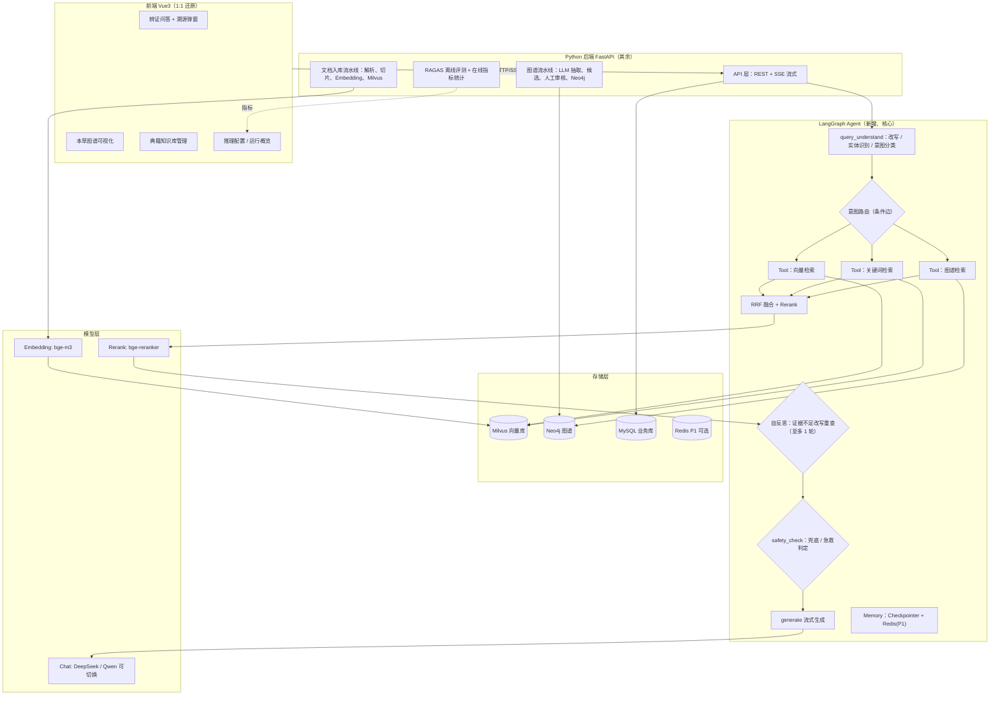

# 本草智问 MediRAG：Java 项目 → Python Agent 方向改造方案（合并版）

> 本方案由项目内两份方案合并而成，**以《MediRAG-Python改造方案.md》为主线**，吸收《项目改造方案.md》的三处亮点（RAGAS 评测体系、自反思重查、Redis 多轮记忆）。合并处均标注「@@取自B@@」。
>
> 目标：把网上找到的「Spring Boot 3 + LangChain4j + Vue3」中医药 RAG 项目，改造成一个
>
> **能写进简历、精准对口 Python Agent 开发实习**
>
> 的项目。
> 硬约束：
>
> 1. **前端界面 1:1 还原原项目效果**（以 8 张截图为视觉基准，不新增原图不存在的能力面板）。
> 2. 后端好的设计保留、不适配的替换；改造方向严格对齐《Agent 岗位分析报告（13 岗位）》。
> 3. 原项目**无源码无数据**，只有简介、思维导图、8 张前端截图。因此前端按截图仿制，后端按本方案从零实现，数据自建替代；简历量化数字必须实测，禁止虚构。
>
> 依据：原项目问答流程图、8 张前端截图、岗位分析报告频次数据（均为项目内真实材料）。

---

## 一、一句话定位

| | 原项目 | 改造后 |
|---|---|---|
| 名称 | 本草智问（中医药知识系统） | **本草智问 Agentic RAG（Python 版）** |
| 本质 | 固定 RAG 流水线的企业知识问答系统 | Agent 自主编排检索工具的**可溯源中医药知识智能体** |
| 后端 | Spring Boot 3 + LangChain4j（Java） | **FastAPI + LangChain + LangGraph（Python）** |
| 前端 | Vue 3 | Vue 3（1:1 还原，不变） |
| 存储 | Milvus + Neo4j + Redis + MySQL | Milvus + Neo4j + MySQL（Redis 为 P1 可选会话记忆）|
| 检索 | 三路固定串行 / 并行调用 | **三路检索封装为 Tool，由 LangGraph Agent 按意图自主路由，证据不足可自反思重查** |
| 简历卖点 | GraphRAG、来源可追溯 | **Agentic GraphRAG：Function Calling 工具编排 + 图谱 / 文献双证据 + 医疗安全兜底 + 评测闭环** |

**核心改造思想一句话**：原项目是"写死的检索流水线"，改造后是"Agent 自己决定用哪些检索工具、按什么顺序用"，并通过有上界的自反思提升召回——正好补上岗位报告里频次最高（13/13）的「Agent 智能体搭建」。

---

## 二、为什么这样改：逐能力对齐 13 个岗位

频次全部来自《Agent 岗位分析报告.html》Top50。原项目状态依据其简介、流程图、截图判定。

| 岗位能力项 | 频次 | 原项目 | 改造后 | 落地位置 |
|---|---|---|---|---|
| Agent / 智能体搭建 | 13 | ✗ | ✅ **LangGraph 状态机 + 条件路由 + 自反思** | `agent/workflow.py` |
| 大语言模型 LLM | 13 | ✅ qwen-plus | ✅ | `llm/` 多模型适配层 |
| Prompt Engineering | 12 | ✅ 中医药专用 | ✅ 补 Few-shot/CoT/结构化输出 | `agent/prompts/` |
| RAG 检索增强生成 | 11 | ✅ 三路检索 | ✅ 保留并强化 | `retrieval/` |
| **Python** | 10 | ✗ Java | ✅ **全量 Python** | 全局 |
| 知识库问答 | 8 | ✅ | ✅ | 文档入库模块 |
| LLM API 调用与模型集成 | 8 | ✅ 单模型 | ✅ **DeepSeek/Qwen 可切换路由** | `llm/router.py` |
| **Function/Tool Calling** | 7 | ✗ | ✅ **三路检索全部 Tool 化** | `agent/tools.py` |
| **LangChain/LangGraph** | 7 | ✗ LangChain4j | ✅ 原生 Python 框架 | 全局 |
| Workflow 工作流编排 | 6 | △ 硬编码链路 | ✅ StateGraph 节点 + 条件边 | `agent/workflow.py` |
| 向量数据库 | 6 | ✅ Milvus | ✅ Milvus（开发期 FAISS 起步） | `vectorstore/` |
| **模型评测 / 效果评估** | 6 | △ 仅页面统计 | ✅ **RAGAS 指标 + 离线评测 + 在线反馈面板** @@取自B@@ | `evaluation/` |
| 多轮对话管理 | 3 | △ 弱 | ✅ LangGraph Checkpointer + 历史改写（P1 升级 Redis 会话）@@取自B@@ | `agent/memory.py` |
| FastAPI / Flask | 3 | ✗ Spring Boot | ✅ FastAPI + SSE | `api/` |
| MySQL | 3 | ✅ | ✅（SQLAlchemy ORM） | `db/` |
| Redis | 3 | ✅ | ○ **P1 可选**（会话记忆 / 缓存，先走内存 dict）@@取自B@@ | `memory/` |
| React/Vue 前端 | 3 | ✅ Vue3 | ✅ Vue3 原样还原 | `web/` |
| Embedding 模型 | 3 | ✅ | ✅ bge-m3 / gte 系列 | 配置项 |
| 知识图谱 | 1（稀缺差异化） | ✅ Neo4j | ✅ 保留，区别于普通 RAG 简历的关键 | `graph/` |
| MCP | 2 | ✗ | ○ 进阶加分：把图谱查询暴露为 MCP Server | `mcp_server/` |
| Docker | 2 | 未体现 | ✅ docker-compose 一键起 | `deploy/` |
| Memory 记忆管理 | 1 | ✗ | ✅ 会话记忆 + 检索反馈记忆 | `agent/memory.py` |
| 大模型微调 LoRA | 4 | ✗ | **不做**（第六节说明） | — |
| 多模态 | 4 | ✗ | **不做** | — |
| 多 Agent 协作 | 4 | ✗ | ○ 进阶：实体抽取独立成审核 Agent，非必须 | — |

结论：频次 ≥5 的核心能力项全部覆盖；「知识图谱 + 医疗安全兜底 + 评测闭环」是多数候选人没有的差异化亮点。

---

## 三、原项目解构（改造前必须吃透的事实）

### 3.1 问答流水线（来自思维导图，逐节点还原）

```
用户问题
 → 问题改写 / 实体识别 / 意图分类          （查询理解层，扇出节点 1→3）
 → 三路并行召回：
     ├─ Milvus 向量召回（语义相似度）
     ├─ 关键词召回（BM25，捕捉中医药专有名词）
     └─ Neo4j 图谱查询（1~2 跳）→ 实体/关系/路径
 → RRF 融合与重排序（向量 + 关键词两路；图谱证据独立汇合，不参与 RRF）
 → 汇合图谱实体关系路径，形成「文献证据」
 → 中医药专用 Prompt 组装
 → SSE 流式回答 + 文献引用 + 图谱路径
```

关键特征：节点[2]为扇出（1→3），节点[5][6]为汇合（2→1），节点[7]为 Prompt 组装。截图「知识检索与图谱溯源」弹窗把链路做成 5 个可见步骤（问句理解→多路检索→证据融合→相关性排序→生成回答）并展示每步中间结果。**这个"检索过程可视化"是极佳面试演示点，必须保留。**

### 3.2 八个前端页面（来自截图）

| # | 页面 | 关键元素（截图事实） |
|---|---|---|
| 1 | 登录页 | 左侧深绿品牌区（"基于知识图谱与 RAG 的中医药智能问答系统"、三特性）；右侧登录卡（admin、记住用户名、体验账号） |
| 2 | 辨证问答（空态） | 左栏会话列表；中部"开始一次可追溯的辨证问答"+ 三特性标签 + 2×3 常用问题卡片 |
| 3 | 辨证问答（回答态） | 流式正文 → 绿色安全提示框 → 图谱依据（【图谱事实 N】实体--关系-->实体）→ 文献来源 → 可折叠"证据来源 (N)"（[图谱]/[文献] 标签）→ 底部输入框 + 免责声明"…拨打 120" |
| 4 | 检索溯源弹窗 | 5 步进度条；步骤 1 原始→改写 query；步骤 2-3 四个数字卡（向量/图谱 N 命中实体/关键词/证据融合 RRF）；步骤 4 进入上下文证据数 + "证据充分，正常生成" |
| 5 | 本草图谱 | 图谱浏览 / 候选审核双 Tab；搜索 + 实体类型筛选；左栏实体列表（类型点）；中部力导向关系图（节点按类型着色、边标注关系）；右栏实体详情 |
| 6 | 典籍知识库 | 顶部统计卡；分类筛选；文档表格（名称/大小/格式/状态/上传时间/操作）；上传弹窗（拖拽、格式清单、≤100MB、**8 类知识主题必选**） |
| 7 | 运行概览 | 问答量趋势折线（近 14 天）、用户角色分布环形图、知识主题分布环形图、知识库状态柱状、检索质量（满意度、兜底率、有用/无用反馈） |
| 8 | 推理配置 | 混合检索组（语义 20 / 关键词 20 / 融合候选 25 / 最终证据 5 / 融合平衡 60）；生成模型组（qwen-plus 下拉、回答灵活度 0.30、问句理解灵活度 0.10）；保存/恢复默认 |
| — | 账户管理 / 我的档案 | 侧栏存在无截图，标准后台页即可，优先级最低 |

> **1:1 还原纪律**：8 张截图是前端唯一真源。不新增原图不存在的能力面板（如独立"Agent 推理面板"）；Agent 的 tool 调用轨迹、反思轮次应放进**已有的检索溯源弹窗**内，通过 SSE `step` 事件逐步点亮。

### 3.3 视觉设计 Token（前端还原直接用）

- 侧边栏：深墨绿底（约 `#16332a`~`#1e4638`），白色 14px 菜单，选中更亮绿块，约 200px 可折叠。
- 主色：中医药绿（约 `#2f7d5b` / `#3a8f63`）。
- 背景：主区浅灰白 `#f6f8f7`，卡片纯白、圆角 10–12px、细边框、极轻阴影。
- 语义色：安全提示 = 浅绿底深绿字；禁忌 = 红褐 `#b4554a`；症状 = 橙；功效/中药/方剂 = 不同深浅绿。
- 字体：系统默认无衬线，标题 18–22px 600 字重，正文 14px。
- 组件库：**Element Plus** + 绿色定制主题变量即可高度还原，图用 ECharts。

---

## 四、目标架构设计

### 4.1 总体架构



### 4.2 核心升级：从「固定流水线」到「Agentic RAG」

**原项目**：三路检索全量写死执行。**改造后**：三路检索是三个标准 Tool，LangGraph 依查询理解节点输出的意图，用条件边决定调哪个、是否并行。

**意图 → 工具路由矩阵**（面试可直接讲）：

| 用户问题类型 | 识别特征 | 路由决策 | 理由 |
|---|---|---|---|
| 组成 / 禁忌 / 关系查询（"四君子汤组成"） | 实体明确、问关系 | **图谱工具为主**（1–2 跳），向量兜底 | 图谱事实精确；截图中该问题命中图谱、向量命中为 0 |
| 概念辨析 / 机理（"风寒束表 vs 风热犯表"） | 无单一实体、需对比 | **向量 + 关键词并行**，图谱补背景 | 需文献段落级证据 |
| 开放综合（"脾气虚的症状和方剂"） | 实体 + 阐述混合 | **三路全开 → RRF** | 保证召回率 |
| 知识库未覆盖 / 闲聊 | 实体为空且向量低分 | **不调工具，直接兜底** | 对应医疗安全兜底，避免编造 |

**自反思重查** @@取自B@@：`fuse_and_rerank` 后若最终证据数 < 阈值或 top 分过低，走一条**受控**的"改写 query → 重查 → 再融合"边，最多 **1 轮**（设硬上限防死循环）。这是对下面 `safety/confidence.py` 兜底的正向补充：先尽力补，再老实说不知道。

**LangGraph State（State）设计**：

```python
class AgentState(TypedDict):
    question: str                 # 用户原始问题
    chat_history: list            # 多轮历史（Memory）
    rewritten_query: str          # 改写后查询
    entities: list[dict]          # 识别的中医药实体（名/类型）
    intent: str                   # relation / concept / complex / chitchat
    plan: list[str]               # Agent 决定调用的工具列表（Function Calling 轨迹）
    vector_hits: list             # 向量召回
    keyword_hits: list            # 关键词召回
    graph_hits: list              # 图谱路径
    fused_evidence: list          # RRF 融合 + rerank 后的证据
    confidence: float             # top 分数 / 命中数综合
    reflect_count: int            # 自反思轮次（硬上限，默认 1）@@取自B@@
    safety_flag: str | None       # emergency / low_confidence / ok
    answer_stream: str            # 最终回答
    trace: list[dict]             # 全链路追踪，喂给溯源弹窗逐步点亮
```

**节点与边**：

```
START
 → query_understand（一次 LLM 调用同时输出 改写query/实体/意图，结构化 JSON）
 → route（条件边：按 intent 选工具子集，体现 Workflow 编排）
 → retrieve（并行执行被选 Tool，每个 Tool 是标准 @tool，即 Function Calling 证据）
 → fuse_and_rerank（RRF 融合 + reranker；图谱证据独立标记，直接进上下文）
 → reflect?（条件边：证据不足且 reflect_count < 上限 → 改写重查；否则放行）@@取自B@@
 → safety_check（两路兜底：急症词表→强制就医；置信度<阈值→"未匹配"）
 → generate（组装中医药专用 Prompt，SSE 流式输出）
 → END
```

> 为什么用"固定状态机 + 有限工具自主路由 + 受控反思"，而不是自由 ReAct 循环？—— 医疗场景要求**可控、可解释、可复现**；自由 ReAct 有 agent drift 风险。这个取舍本身是面试加分回答（体现工程判断）。审校 Agent @@取自B@@ 列为进阶可选项，主链路不强制（保持范围收敛）。

### 4.3 SSE 事件协议（前端溯源弹窗依赖它）

后端用 SSE（FastAPI `StreamingResponse` / `sse-starlette`）按节点推进度：

```
event: step     data: {"step":"understand","title":"问句理解","raw":...,"rewritten":...}
event: step     data: {"step":"retrieve","vector_n":20,"graph_n":22,"keyword_n":0,"entities":[...]}
event: step     data: {"step":"reflect","round":1,"reason":"证据不足","rewritten2":...}   # 自反思时下发
event: step     data: {"step":"fuse","candidate_n":25,"method":"RRF"}
event: step     data: {"step":"rerank","evidence_n":5,"confidence":0.82,"status":"证据充分，正常生成"}
event: token    data: {"text":"四君子汤"}     # 回答正文逐 token
event: references data: {"docs":[...],"graph_facts":[...]}
event: safety   data: {"type":"ok"|"low_confidence"|"emergency","message":...}
event: done     data: {"message_id":...,"metrics":{...}}
```

> Agent 的工具调用轨迹、反思轮次通过新增 `step:"reflect"` 与既有 `step` 事件放进溯源弹窗内展示，**不新增独立面板**，守住 1:1 还原纪律。

### 4.4 医疗安全兜底机制（保留并做成亮点，全链路可解释）

1. **检索置信度兜底**：最终证据数 = 0 或 rerank top 分低于阈值 → 先走自反思补查一轮；仍不足则明确回复"知识库未检索到可靠依据"，宁可说不知道也不编（对应 LLM 幻觉治理）。@@取自B@@
2. **急救症状拦截**：问题或实体命中急症词表（胸痛/昏迷/大出血/休克/孕妇出血…）→ 回答顶部强制"请立即就医 / 拨打 120"，呼应截图免责声明。
3. **图谱事实约束**：回答 Prompt 强制"组成 / 禁忌类结论只能引用给定图谱事实，不得加减药材"，对应截图绿色提示框。

---

## 五、技术选型总表（保留 / 替换 / 砍掉）

| 层 | 原项目 | Python 改造选型 | 决策 | 理由 |
|---|---|---|---|---|
| Web 框架 | Spring Boot 3 | **FastAPI** + uvicorn + sse-starlette | 替换 | 岗位 3 次；原生 async，SSE 简单 |
| Agent/LLM 编排 | LangChain4j | **LangChain + LangGraph** | 替换 | 岗位 7 次，Python Agent 生态主流 |
| 向量库 | Milvus | **Milvus**（开发期 milvus-lite / FAISS） | 保留 | 岗位 6 次；与原项目一致 |
| 图谱库 | Neo4j | **Neo4j** + 官方 Python driver | 保留 | 差异化核心，1–2 跳 Cypher 直接迁移 |
| 关键词检索 | 未明示 | **rank-bm25** 起步，进阶 ES | 简化 | 无需为 BM25 单独部署 ES |
| Rerank | gte-rerank | **bge-reranker-v2-m3**（本地） | 替换 | 开源免费、中文效果好 |
| Embedding | 未明示 | **bge-m3**（本地）或 API | 替换 | 免费可复现 |
| 对话模型 | qwen-plus | **DeepSeek + Qwen 双适配，配置可切换** | 升级 | 命中"多模型集成"8 岗位 |
| 关系型库 | MySQL | MySQL + **SQLAlchemy 2** | 保留 | 文档/会话/反馈/用户 |
| 缓存 | Redis | Redis **P1 可选**（会话缓存），先走内存 dict @@取自B@@ | 降级可选 | 多轮记忆升级点，不阻塞主线 |
| 文档解析 | 多格式自研 | **unstructured + pypdf + python-docx + openpyxl + python-pptx + markdownify** | 替换 | Python 生态解析更简单 |
| 前端 | Vue 3 | **Vue 3 + Vite + TS + Pinia + Element Plus + ECharts** | 保留还原 | 见第七节 |
| 关系图渲染 | 未明示 | **ECharts graph** 力导向 | 新增 | 还原本草图谱 |
| 评测 | 页面统计 | **RAGAS + 离线评测 + 在线反馈** @@取自B@@ | 升级 | 命中"模型评测"6 岗位，见 6.8 |
| 部署 | 未明示 | **Docker Compose** 一键起中间件 | 新增 | 命中 Docker，面试官可复现 |

### 5.1 运行默认配置（可直接生成 `.env.example`）

> **决策原则**：全部可选型选「API 优先、本地兜底」，经 `.env` 一键切换，消除「GPU 有没有」这一阶段 0/1 最大的不确定性。以下默认值可直接用于脚手架与阶段 1 向量化，不再悬空。

| 配置项 | 默认值 | 说明（如何切换） |
|---|---|---|
| 向量库 | **numpy_local**（阶段 1 已落地：Windows 不支持 milvus-lite，接口已按 Milvus schema 抽象） | 开发机为 Windows，milvus-lite 官方仅支持 Linux/macOS；阶段 1 用 numpy 余弦后端 + JSON 持久化，`deploy/` 提供 Milvus standalone 升级路径 |
| EMBED_VENDOR / EMBED_MODEL | `siliconflow` / `bge-m3` | 1024 维、中文多语言强；OpenAI 兼容 API；可切 `local`（sentence-transformers）或 Qwen 嵌入 |
| RERANK_VENDOR / RERANK_MODEL | `siliconflow` / `bge-reranker-v2-m3` | rerank 走 API 免 GPU；可切 `local` |
| LLM_ROUTER / MODEL_MAIN | `deepseek` / `deepseek-chat` | 主力、便宜；可切 `MODEL_ALT=qwen-plus` |
| KEYWORD_ENGINE | `rank-bm25`（内存） | 不单独部署 ES |
| REDIS_MODE | `memory`（内存 dict） | P1 再切 `redis` |
| EMBED_DIM | `1024` | 与 Milvus collection schema 一致 |

> **需你确认的一条假设**：开发机若无 NVIDIA GPU，Embedding/Rerank 默认走 SiliconFlow API（需 SiliconFlow 账号，平台有免费额度）；若有 GPU 则改 `local` 离线跑 2GB+ 模型。我按「API 优先」下单不阻塞阶段脚手架——若你有 GPU 或更偏好纯离线，只需在产出 `.env.example` 时把两个 VENDOR 改成 `local`。

---

## 六、后端工程设计

### 6.1 目录结构

```
medirag-python/
├── backend/
│   ├── app/
│   │   ├── main.py                    # FastAPI 入口、CORS、路由挂载
│   │   ├── config.py                  # pydantic-settings 读 .env
│   │   ├── api/
│   │   │   ├── chat.py                # 问答 SSE 接口
│   │   │   ├── knowledge.py           # 知识库上传/列表/下载/重命名/删除
│   │   │   ├── graph_api.py           # 图谱搜索/详情/候选审核
│   │   │   ├── config_api.py          # 推理配置读写
│   │   │   ├── stats.py               # 运行概览统计
│   │   │   └── auth.py                # 登录/角色（简化 JWT）
│   │   ├── agent/
│   │   │   ├── workflow.py            # LangGraph StateGraph（核心）
│   │   │   ├── state.py               # AgentState
│   │   │   ├── tools.py               # 三个检索 Tool（Function Calling）
│   │   │   ├── reflect.py             # 自反思：改写重查入口 @@取自B@@
│   │   │   ├── memory.py              # checkpointer / 多轮历史（P1 接 Redis）
│   │   │   └── prompts/               # 全部 Prompt 模板
│   │   ├── retrieval/
│   │   │   ├── vector_store.py        # Milvus 封装
│   │   │   ├── keyword.py             # BM25 关键词召回
│   │   │   ├── rrf.py                 # RRF 融合算法
│   │   │   └── reranker.py            # bge-reranker 封装
│   │   ├── graph/
│   │   │   ├── neo4j_client.py        # 驱动、1~2 跳 Cypher
│   │   │   ├── extractor.py           # LLM 抽取实体关系（候选）
│   │   │   └── importer.py            # 基础数据导入
│   │   ├── ingestion/
│   │   │   ├── parsers.py             # 10+ 格式解析分发
│   │   │   ├── splitter.py            # 切片策略（带章节/页码元数据）
│   │   │   └── pipeline.py            # 解析→切片→embedding→Milvus 异步任务
│   │   ├── llm/
│   │   │   ├── router.py              # 多模型适配（deepseek/qwen 统一接口）
│   │   │   └── schemas.py             # 结构化输出模型
│   │   ├── safety/
│   │   │   ├── emergency.py           # 急症词表拦截
│   │   │   └── confidence.py          # 置信度兜底 + 自反思触发判定 @@取自B@@
│   │   ├── evaluation/
│   │   │   ├── golden_qa.jsonl        # 标注评测集（50+ 条）
│   │   │   ├── run_eval.py            # 离线评测：RAGAS + 命中率 + 引用准确率 @@取自B@@
│   │   │   └── metrics.py             # 在线指标聚合
│   │   ├── models/                    # SQLAlchemy ORM 与 Pydantic DTO
│   │   └── db.py                      # 引擎/Session
│   ├── tests/
│   ├── .env.example
│   └── requirements.txt
├── web/                               # Vue3 前端（第七节）
├── deploy/
│   └── docker-compose.yml             # milvus + neo4j + mysql + redis(可选)
├── data/                              # 原始中医药文档 / 图谱基础数据 / 评测集
└── README.md
```

### 6.2 三个检索 Tool 的签名（Function Calling 的直接证据）

```python
from langchain_core.tools import tool

@tool
def vector_search(query: str, top_k: int = 20) -> list[dict]:
    """语义向量检索：用于概念解释、机理对比、症状与方剂关联等需要语义理解的问题。
    返回切片文本、文档名、章节、页码、相似度分数。"""

@tool
def keyword_search(query: str, top_k: int = 20) -> list[dict]:
    """关键词检索(BM25)：用于精确匹配中医药专有名词、方剂名、药材名、术语缩写。
    返回切片文本与 BM25 分数。"""

@tool
def graph_search(entity: str, hop: int = 2) -> dict:
    """中医药知识图谱检索：查询某实体(药材/方剂/证候/症状/功效/禁忌)的 1~2 跳关系，
    返回节点、关系、路径，用于组成、配伍、禁忌等事实型问题。"""
```

> 面试话术：三路检索封装成三个标准 Tool，query_understand 节点做意图分类，LangGraph 条件边决定工具子集，证据不足走受控自反思，检索过程经 trace 全程对用户可见——一句命中 Agent / Function Calling / Workflow / RAG / 可解释性 5 个考点。

### 6.3 RRF 融合（保留原算法，Python 实现很短）

```python
def rrf_fuse(rank_lists: list[list], k: int = 60, weights: list[float] | None = None):
    # k 对应推理配置页"融合平衡系数"语义；按文档切片去重，累加 1/(k+rank)
    scores = {}
    for li, docs in enumerate(rank_lists):
        w = (weights or [1]*len(rank_lists))[li]
        for rank, d in enumerate(docs):
            key = d["chunk_id"]
            scores[key] = scores.get(key, 0) + w * (1 / (k + rank + 1))
    return sorted(scores.items(), key=lambda x: -x[1])
```

融合候选 25 → rerank 取最终证据 5，数值与推理配置页一一对应，可由前端实时调整（存 MySQL，请求时读取），实现"变更保存后将立即应用到新问答请求"。

### 6.4 Milvus Collection Schema

| 字段 | 类型 | 说明 |
|---|---|---|
| chunk_id | VarChar 主键 | 切片唯一 ID（去重 / RRF 用） |
| doc_id / doc_name | VarChar | 来源文档 |
| chapter | VarChar | 章节（来源可追溯） |
| page_no | INT16 | 页码（来源可追溯） |
| topic | VarChar | 知识主题（8 大类，上传时选择） |
| text | VarChar | 切片原文 |
| embedding | FloatVector (bge-m3=1024 维) | 语义向量 |
| 索引 | IVF_FLAT/HNSW + COSINE | |

### 6.5 Neo4j 图谱 Schema（按截图实体类型还原）

- **节点标签**：`方剂`、`中药`、`证候`、`症状`、`功效`、`禁忌`（截图关系图：方剂四君子汤/归脾汤/酸枣仁汤，中药人参/白术/茯苓/炙甘草/黄芪/当归，症状便溏/健忘/口渴，功效益气健脾/养血安神，禁忌"对方剂成分过敏者禁用"）。
- **关系类型**：`组成`（方剂-中药）、`主治`（方剂-证候）、`缓解`（方剂/中药-症状）、`具有功效`、`禁忌`。
- **节点属性**：name、别名、说明、来源、审核状态（候选/已发布）。
- **1–2 跳 Cypher 模板**：

```cypher
// 1 跳：某方剂的全部组成与禁忌
MATCH (e)-[r]-(n) WHERE e.name = $name RETURN e,r,n;
// 2 跳：方剂 → 中药 → 该药的禁忌/功效
MATCH (f:方剂 {name:$name})-[:组成]->(h:中药)-[r]->(x) RETURN f,h,r,x;
```

- **候选审核闭环**（对应"候选审核"Tab）：`extractor.py` 用 LLM 抽 (实体,关系,实体) → 写 Neo4j 标 `status=候选` → 前端人工确认 → 改 `已发布`；问答只查已发布节点。这是"审核后实体才进图谱"的工程闭环，原项目亮点，保留。

### 6.6 MySQL 核心表

```
user(id, username, password_hash, role[管理员/中医药从业者/知识用户], ...)
document(id, name, file_type, size, topic, status[上传中/处理中/就绪/失败], chunk_count, uploaded_at)
chat_session(id, user_id, title, created_at, favorite)
chat_message(id, session_id, role, content, trace_json, created_at)
inference_config(user_id, semantic_k, keyword_k, fuse_candidate, final_evidence, rrf_k, model_name, answer_temp, query_temp)
feedback(id, message_id, useful[1/0])
retrieval_log(id, message_id, vector_n, keyword_n, graph_n, evidence_n, confidence, is_fallback, reflect_round)@@取自B@@
```

### 6.7 Prompt 体系（独立目录，便于讲 Prompt Engineering）

| Prompt 文件 | 职责 | 对应岗位技巧 |
|---|---|---|
| `query_understand.txt` | 一次输出 改写 query / 实体数组 / 意图枚举（强制 JSON） | 结构化输出、Few-shot 给 3 示例 |
| `query_rewrite_reflect.txt` @@取自B@@ | 证据不足时的二次改写（带失败原因上下文） | 自反思、CoT |
| `answer_cn_tcm.txt` | 中医药专用回答：只依据给定文献+图谱事实；**先读懂再自己组织，禁止照抄原文**（文言条文须转述白话，原句引用合计 ≤40 字）；**简洁突出重点**（一般 150–300 字，先结论后要点，不做无关引申与同义重复）；组成/禁忌只依据图谱事实；输出引用编号；纯文本不带 Markdown、不重复免责声明 | CoT、角色设定、约束防幻觉、输出格式约束 |
| `entity_extract.txt` | 从切片抽取实体关系三元组，输出 JSON 数组 | 结构化输出 |
| `safety.txt` | 低置信度 / 急症场景固定话术模板 | 安全对齐 |
| `query_rewrite_history.txt` | 结合多轮历史把指代性问题改写完整 | 多轮对话 |

### 6.8 评测闭环（把"运行概览"从摆设升级成真评测）@@取自B@@

- **离线**：手工标注 50+ 条 Golden QA（文献类/图谱类/综述类/拒答类四分布，图谱类专门考察 Neo4j 路径）。`run_eval.py` 批量跑，输出：
  - **RAGAS 三指标**：faithfulness（忠实度）、answer relevancy、context precision；
  - **检索指标**：Recall@k、MRR、引用准确率；
  - **兜底/反思统计**：兜底触发率、自反思命中补召回率；
  - **消融对比**：纯向量 vs 向量+关键词 vs 三路融合，用数字证明多路融合有效（写进简历的量化结果来源，必须实测）。
- **bad case 闭环**：跑完把失败样本归档到 `evaluation/bad_cases/`，记录迭代（改切片 / 改 Prompt / 调 rerank），输出前后对比。
- **在线**：用户"有用/无用"反馈、每次检索命中数与兜底/反思情况落 `retrieval_log`，运行概览页图表全部读真实数据。

---

## 七、前端 1:1 还原方案

### 7.1 技术栈

**Vue 3 + Vite + TypeScript + Pinia + Vue Router + Element Plus + ECharts**。原界面是标准企业后台，Element Plus 定制主题后视觉最接近；ECharts 同时负责概览统计图和图谱关系图（graph 力导向），减少依赖。

### 7.2 页面 → 组件拆解

```
src/
├── layouts/MainLayout.vue      # 深绿侧边栏(8菜单)+顶栏
├── layouts/BlankLayout.vue      # 登录页布局
├── styles/theme.ts              # 墨绿主题变量（3.3 Token）
├── views/
│   ├── Login.vue
│   ├── qa/Chat.vue              # 会话栏+空态+回答流
│   ├── qa/components/
│   │   ├── SessionList.vue      # 会话列表/收藏
│   │   ├── EmptyGuide.vue       # 常用问题 2×3 卡片
│   │   ├── AnswerBubble.vue     # 正文+绿色安全框+图谱依据+证据折叠
│   │   ├── SourceList.vue       # 证据来源（[图谱]/[文献] 标签）
│   │   └── TraceDialog.vue      # 检索溯源弹窗（5 步，SSE 驱动点亮；含自反思提示）
│   ├── graph/GraphExplore.vue   # 本草图谱：左实体列表+ECharts关系图+右详情
│   ├── graph/CandidateReview.vue# 候选审核 Tab
│   ├── knowledge/Library.vue    # 典籍知识库表格+统计卡
│   ├── knowledge/UploadDialog.vue# 上传弹窗（拖拽/格式/主题必选）
│   ├── overview/Dashboard.vue   # 运行概览 4 图 + 质量卡
│   ├── config/Inference.vue     # 推理配置
│   ├── account/、profile/       # P2
├── api/                          # axios；chat 用 fetch ReadableStream 解析 SSE
└── stores/                       # session / config / user
```

### 7.3 关键交互实现要点

- **SSE 打字机**：`fetch + ReadableStream`（POST 带请求体，EventSource 不支持 POST），按 4.3 的 event 类型分别处理：`token` 追加正文，`step` 更新溯源弹窗（含反思轮次提示），`references` 渲染引用，`done` 落库。
- **溯源弹窗**：默认随提问自动打开，五步进度条据 `step` 依次高亮，数字卡实时填入命中数——和截图完全一致。
- **图谱关系图**：ECharts graph 力导向，5 类节点 5 色，边 label 显示关系词；点击节点拉详情，左栏列表点击聚焦。
- **上传流程**：拖拽上传后状态轮询（上传中→处理中→就绪/失败），后端 ingestion 异步流水线每阶段更新 status。
- **配置生效**：推理配置保存即写后端，下一次请求带上，体现"立即应用"。

### 7.4 还原优先级（时间不够时取舍）

- **P0（主链路，必须）**：登录、辨证问答（溯源弹窗/证据面板/安全提示）、本草图谱、典籍知识库上传。
- **P1**：推理配置、运行概览（接真实统计）、Redis 会话记忆 @@取自B@@。
- **P2**：账户管理、我的档案、收藏、下载/重命名等边角。

---

## 八、后端 API 清单

| 方法 | 路径 | 功能 | 对应页面 |
|---|---|---|---|
| POST | `/api/auth/login` | 登录，返回 JWT | 登录页 |
| POST | `/api/auth/register` | 自助注册（固定发放最低权限「知识用户」，成功即返回 token） | 登录页「立即注册」 |
| PUT | `/api/users/{id}/password` | 管理员重置指定用户密码（仅管理员） | 账户管理「重置密码」/ 登录页「忘记密码」的落地点 |
| GET | `/api/chat/sessions` / POST `/api/chat/session` | 会话列表 / 新建 | 问答页 |
| **POST** | `/api/chat/stream` | **SSE 问答主接口（4.3 协议）** | 问答页 + 溯源 |
| POST | `/api/chat/sessions/{sid}/withdraw` | 撤回一轮问答：**回滚**到该提问之前（该轮及其之后一并删，之前的保留；body `{seq?}`，缺省撤末轮；删空则连会话删） | 回答卡片底部撤回图标 |
| DELETE | `/api/chat/sessions?favorite=` | 清空当前用户会话（只删自己的，返回删除条数）；`favorite` **必填**（缺参 422，fail closed）：true 只清收藏、false 清全部，与前端筛选页联动 | 会话栏底部「清空会话 / 清空收藏」 |
| POST | `/api/chat/feedback` | 有用 / 无用反馈 | 回答区 |
| GET/POST | `/api/documents` | 文档列表 / 上传（multipart） | 知识库 |
| GET | `/api/documents/{id}/parse-status` | 解析状态轮询 | 知识库 |
| GET | `/api/graph/search?entity=&type=` | 实体搜索 | 本草图谱 |
| GET | `/api/graph/neighbors?name=&hop=2` | 关系图数据 | 本草图谱 |
| GET/POST | `/api/graph/candidates`、`/approve/{id}` | 候选列表 / 审核发布 | 候选审核 |
| GET/PUT | `/api/inference-config` | 推理配置读写 | 推理配置页 |
| GET | `/api/stats/overview` | 趋势 / 分布 / 质量指标 | 运行概览 |

---

## 九、分阶段实施计划（按"基础一般、边学边做"设计，每步可独立验证）

> 节奏每天 2–4 小时，总计约 5–7 周；每阶段结束必须有可演示产出，不攒着最后集成。

### 阶段 0：环境与脚手架（2–3 天）
- docker-compose 拉起 Milvus（或 milvus-lite）、Neo4j、MySQL；Python 3.11 venv、FastAPI 骨架、Vue3 Vite 骨架、Element Plus 墨绿主题。
- **验证**：后端 `/health` 通、前端空页带侧边栏、Neo4j Browser 能开。

### 阶段 1：最小 RAG 闭环（5–7 天）—— 先别碰 Agent
- 单文档（1 个中医 docx）解析→切片→bge-m3→Milvus；FastAPI 普通 POST 问答：检索 top5 → 拼 Prompt → DeepSeek 返回；前端最简对话页。
- **验证**：能对文档提问并拿到带引用的回答。先建立正反馈。

### 阶段 2：三路检索 + RRF + Rerank（7–10 天）
- 加 BM25、接 Neo4j（先导一份方剂基础数据）、RRF、bge-reranker；同步做溯源弹窗展示三路命中数。
- **验证**："四君子汤组成"走图谱、对比类走文献；截图那种命中面板能复现。

### 阶段 3：Agentic 化（核心，7–10 天）—— 项目性质在此蜕变
- 学 LangGraph：定义 State、三路检索改造 `@tool`、query_understand 结构化输出、条件边路由、checkpointer 多轮记忆；**自反思重查（≤1 轮）**；SSE 事件按节点发出；两层 safety 兜底；多模型路由切换。@@取自B@@
- **验证**：不同问题走不同工具组合，trace 可见 plan；多轮指代正确改写；乱问触发兜底；构造"首轮不足、反思后补查成功"的 demo case。

### 阶段 4：知识库管理 + 图谱审核闭环（5–7 天）
- 10+ 格式解析、异步入库流水线 + 状态轮询、上传弹窗；LLM 实体关系抽取→候选→审核→发布。
- **验证**：上传 PDF 后状态变就绪、可被检索；抽取的三元组审核后出现在图谱页。

### 阶段 5：前端全量还原 + 配置 / 概览（7 天）
- 按 P0→P1→P2 补齐所有页面；推理配置真实生效；运行概览接 `retrieval_log` 真实数据；P1 可选接 Redis 会话记忆。@@取自B@@
- **验证**：逐页对照原始截图，布局/配色/交互一致。

### 阶段 6：评测、部署、简历（5–7 天）
- 标 50+ 条 Golden QA，跑 RAGAS + 消融实验拿真实数字；bad case 归档记录一轮迭代前后对比；README（架构图+启动步骤+演示 GIF）；docker-compose 一键部署；按第十节写简历 bullet。@@取自B@@
- **验证**：换机 clone 按 README 能起；简历每条 bullet 都能被追问到代码细节。

---

## 十、简历包装（项目经历可直接改用）

**项目名**：本草智问 —— 基于 LangGraph 的 Agentic 中医药知识问答系统（个人项目）

**技术栈**：Python、FastAPI、LangChain/LangGraph、Milvus、Neo4j、MySQL、RAGAS、Vue3、Docker

> 以下为写法模板，**括号内数字必须替换为阶段 6 实测值，严禁照抄编造**：

- 设计 LangGraph 状态机驱动的 Agentic RAG 流水线，将向量检索、BM25、知识图谱查询封装为 3 个标准 Tool，由查询理解节点输出意图后经条件边自主路由，并在证据不足时触发受控自反思重查，相比固定三路全量调用减少（X%）无效检索。

- 实现 Milvus 语义召回 + BM25 关键词召回 + Neo4j 1–2 跳图谱查询的混合检索，RRF 融合后经 bge-reranker 精排；在自建（N）条 Golden QA 上 Recall@5 较纯向量提升（X 个百分点），图谱证据使组成/禁忌类问题事实准确率达（X%）。

- 用 RAGAS 搭建评测体系（faithfulness / answer relevancy / context precision），结合检索命中率、引用准确率与 bad case 闭环迭代，驱动切片与 Prompt 参数调优。@@取自B@@

- 构建双层医疗安全兜底 + 受控自反思：置信度不足时先补查、仍不足则拒答提示未匹配，急症词表命中强制就医引导；回答附带文档名/章节/页码与图谱路径，前端 SSE 实时展示 5 步检索过程与反思轨迹。

- 实现 10+ 格式文档自动入库（解析→切片→向量化→Milvus）与"LLM 抽取三元组→人工审核→发布图谱"知识闭环；搭建综合离线评测集与在线反馈指标面板。

---

## 十一、明确不做什么 & 避坑

1. **不做模型微调 / LoRA**：虽被 4 岗位提及，但需显卡和数据、周期长，且 RAG/Agent 岗面试几乎不追问微调；把时间投在 Agent 和评测上回报更高。面试被问就说"当前阶段 RAG 性价比高于微调，我了解 LoRA 原理但项目选型上用 RAG 解决知识更新问题"。
2. **不做多模态 / 数字人**：偏离中医药文本主线，做了反而稀释主题。
3. **多 Agent 不做为主链路**：单 Agent + 多 Tool + 受控反思已覆盖考点；审校 Agent 列进阶可选项，等主链路稳定再考虑。
4. **别一上来就啃全栈**：严格按阶段 1→6，先跑通最小 RAG 再 Agentic 化。Milvus 起不来就先用 milvus-lite/FAISS，别在部署上卡一周。
5. **数字必须实测**：简历所有百分比来自阶段 6 评测脚本，面试官必追问"怎么测的、数据集多大、怎么标注"，这正是展示评测能力（6 岗位考点）的机会。
6. **API Key 与成本**：开发期主力 DeepSeek（便宜），Qwen 做第二适配；Embedding/Rerank 尽量本地跑，保证可离线复现。@@取自B@@
7. **法律与伦理**：中医药数据只用于学习演示，README 和页面保留"不替代医师诊断"声明（原项目已有，沿用）。

---

## 十二、数据方案（原项目数据拿不到，自建替代）@@取自B@@

原则：**小而真**——语料量不用大，但要真实、可引用、能支撑图谱构建和评测。

- **文献语料**（供向量 + 关键词）：中医药经典公版文本（《伤寒论》《金匮要略》《黄帝内经·素问》等开源整理版），清洗后按"条文"自然切片（古籍天然条目化，切片策略本身是可讲优化点）；辅以中药/方剂百科结构化词条。
- **知识图谱**（供 Neo4j）：基于语料自建小规模图谱（目标 500~2000 节点），schema：节点 `中药/方剂/证候/症状/条文`，关系 `组成/主治/表现/源自/禁忌`。数据来源优先级：开源中医 KG 项目抽子集 > 结构化百科半自动 + 人工校验 > LLM 辅助抽取 + 人工校验（抽取过程可写成简历的"数据工程"叙事）。
- **评测集**：自建 50+ 条问答对（文献/图谱/综述/拒答四分布），图谱类问题专门考察 Neo4j 路径输出。

---

## 十三、交付后下一步

本方案确定后，建议按顺序让我协助：

1. 固化为《前端还原规格文档》（从 8 张截图逐屏提取，作为两方案共用真源）；
2. 生成阶段 0 的 `docker-compose.yml` + 后端 / 前端脚手架；
3. 生成阶段 1 最小 RAG 闭环的完整可运行代码；
4. 后续逐阶段推进，每阶段附验证步骤。